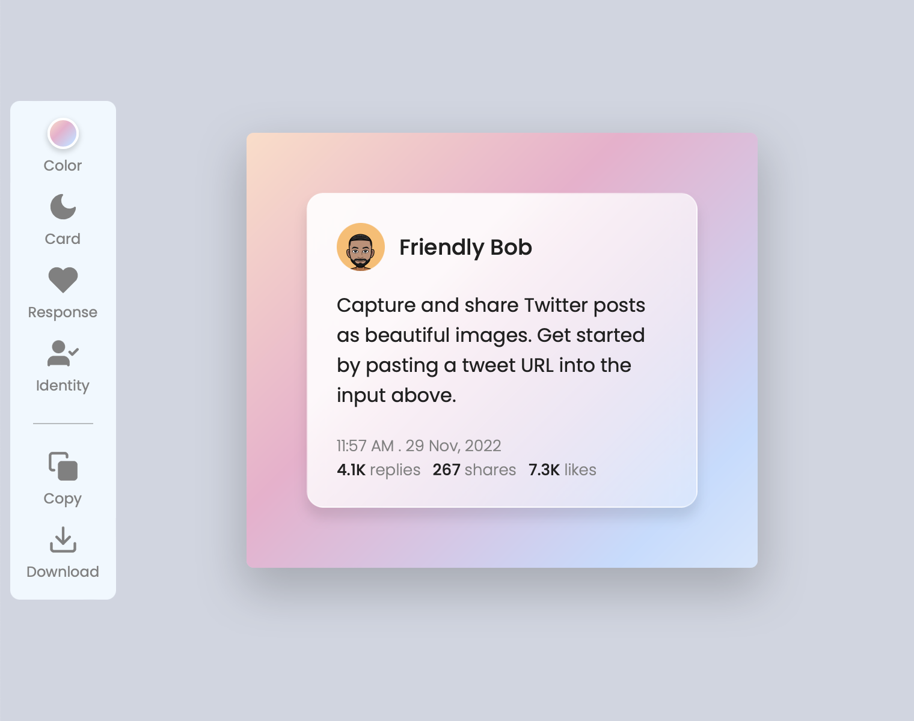
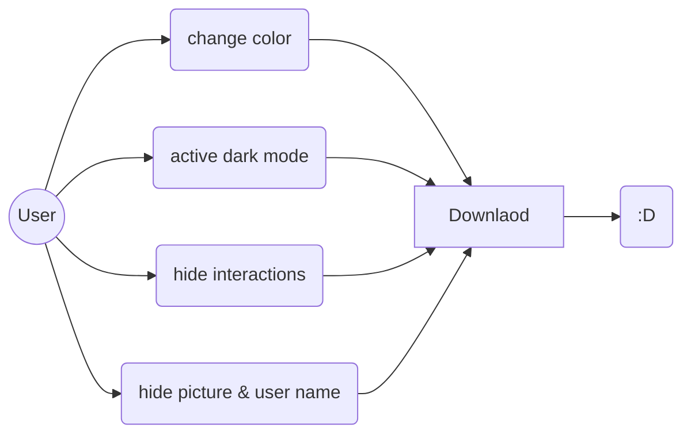

<h1 align="center"><u>Tweepy</u></h1>

Tweepy est un petite application qui permet de capturer et de partager des publications Twitter sous forme de belles images, avec des fonds colorés et personnalisables.

- **importation automatique des tweets :** il suffit de copier-coller l’adresse URL du tweet que vous souhaitez capturer dans la barre de recherche, et l’aperçu de la capture se génère automatiquement au milieu de l’interface.
- > **Note:** vous pouvez taper un texte librement au milieu de l’interface.

- **personnalisation du fond :** vous êtes libre de choisir le fond coloré qui entoure la capture, parmi 8 nuances, ou bien de choisir vos propres couleurs.

- **activation du dark mode :** dans le menu de l’éditeur, le bouton Card permet de passer le fond du tweet en noir, comme sur le mode nuit du réseau social.

- **affichage des statistiques Twitter :** le bouton Response permet d’afficher ou non le nombre de retweets, retweets cités et likes du tweet.

- **affichage des informations de l'utilisateur :** le bouton Identity permet d’afficher ou non le photo et le nom du tweet.

